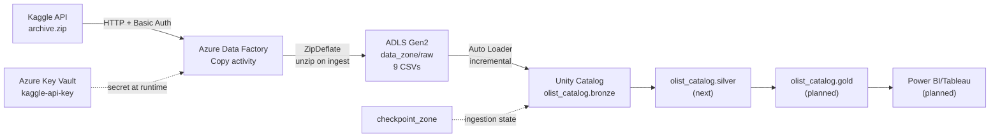

# Olist Data Engineering Pipeline

End-to-end Azure data pipeline built on the [Olist Brazilian E-Commerce dataset](https://www.kaggle.com/datasets/olistbr/brazilian-ecommerce), following medallion architecture: **Azure Data Factory → ADLS Gen2 → Databricks (Unity Catalog) → Power BI/Tableau**.

This repository is a working portfolio project. Every stage is documented with the reasoning behind it, including the problems hit along the way and how they were diagnosed.

---

## Architecture



---

## Current status

| Stage | Status | What it does |
|---|---|---|
| Storage & governance | Complete | ADLS Gen2 lake, Unity Catalog, external locations, RBAC |
| ADF ingestion | Complete | Authenticated pull from Kaggle API into `raw/` |
| Bronze layer | Complete | 9 raw CSVs registered as Delta tables via Auto Loader |
| Silver layer | Next | Typing, null handling, deduplication, joins |
| Gold layer | Planned | Business aggregates for reporting |
| Power BI / Tableau| Planned | Dashboard on the Gold layer |

**Bronze layer as built:** 9 tables, 1,550,922 rows, row counts validated against source, zero rescued records, re-runs verified to load nothing twice.

---

## Tech stack

| Component | Purpose |
|---|---|
| Azure Data Lake Storage Gen2 | Data lake storage, medallion zones |
| Azure Data Factory (V2) | Ingestion from the Kaggle API |
| Azure Key Vault | Secret storage; no credentials in code or config |
| Azure Databricks (Premium) | Transformation compute |
| Unity Catalog | Governance, catalog/schema/table namespace |
| Delta Lake | Table format for all layers |
| Auto Loader | Incremental, checkpoint-tracked file ingestion |
| PySpark + Spark SQL | Ingestion logic and validation |
| Power BI / Tableau| Reporting layer (planned) |

---

## Repository structure

```
olist-data-engineering-pipeline/
├── notebooks/
│   └── 01_bronze_ingestion.ipynb    Auto Loader ingestion, raw CSVs → Bronze tables
├── olist_customers_dataset.csv      Test file used to prove the ADF HTTP connector
├── .gitignore
├── LICENSE                          MIT
└── README.md
```

---

## Storage layout

A single container with folders, rather than one container per medallion layer — fewer permission boundaries to manage, and closer to how most teams structure a lake.

```
olist (container)
├── checkpoint_zone/          Auto Loader ingestion state (bookkeeping, not data)
└── data_zone/
    ├── raw/                  Bronze source — 9 CSVs, untouched
    ├── raw_sample/           Scratch area for mechanism tests
    ├── silver/               Cleaned and typed data
    └── gold/                 Aggregated, business-ready data
```

Checkpoints are deliberately kept outside `data_zone`. They record how much of a source has been processed — pipeline state, not data — and mixing the two makes both harder to reason about.

---

## Pipeline stages

### 1. Ingestion — Azure Data Factory

ADF authenticates to the Kaggle API using HTTP Basic authentication. The API key is stored in Azure Key Vault and pulled at runtime through a Key Vault linked service, so no secret exists in plain text anywhere in the pipeline definition.

A single Copy activity downloads `archive.zip` and decompresses it in flight using the dataset's `ZipDeflate` compression setting, landing all 9 CSVs in `data_zone/raw` with their original filenames.

**ADF objects**

| Type | Name | Purpose |
|---|---|---|
| Linked service | `ls_http_kaggle_source` | Kaggle API, Basic auth via Key Vault |
| Linked service | `ls_akv_olist` | Key Vault access via managed identity |
| Linked service | `ls_adls_olist` | ADLS Gen2 sink |
| Dataset | `ds_http_kaggle_archive` | Zip source, `ZipDeflate` |
| Dataset | `ds_adls_raw_kaggle_archive` | Binary sink into `data_zone/raw` |
| Pipeline | `pl_ingest_kaggle_full_dataset` | The full ingestion run |

### 2. Bronze — Databricks Auto Loader

[`notebooks/01_bronze_ingestion.ipynb`](notebooks/01_bronze_ingestion.ipynb)

Each CSV is loaded into a managed Delta table in `olist_catalog.bronze` using Auto Loader with `trigger(availableNow=True)` — the streaming engine running as an incremental batch job, so the cluster starts, processes what is new, and stops.

**Bronze principles applied**

- **No transformation.** All columns land as strings. Casting `customer_zip_code_prefix` to a number would silently drop leading zeros; type decisions belong in Silver, made deliberately.
- **Lineage on every row.** `_source_file` and `_ingested_at` are added to every table.
- **Idempotent by design.** A per-table checkpoint in `checkpoint_zone` records which files have been read. Re-running the notebook loads nothing twice — verified, not assumed.
- **Configuration over repetition.** The nine files are declared once as a list; one function loads them all. Adding a tenth source is one line.

**Bronze tables**

| Table | Source file | Rows |
|---|---|---|
| `customers` | `olist_customers_dataset.csv` | 99,441 |
| `geolocation` | `olist_geolocation_dataset.csv` | 1,000,163 |
| `order_items` | `olist_order_items_dataset.csv` | 112,650 |
| `order_payments` | `olist_order_payments_dataset.csv` | 103,886 |
| `order_reviews` | `olist_order_reviews_dataset.csv` | 99,224 |
| `orders` | `olist_orders_dataset.csv` | 99,441 |
| `products` | `olist_products_dataset.csv` | 32,951 |
| `sellers` | `olist_sellers_dataset.csv` | 3,095 |
| `product_category_translation` | `product_category_name_translation.csv` | 71 |

`order_reviews` is read with `multiLine` enabled — review text contains line breaks and commas inside quoted fields, which default CSV parsing would split into broken rows.

---

## Security

- **No secrets in code or configuration.** The Kaggle API key lives in Azure Key Vault and is read at runtime by ADF's managed identity.
- **Managed identities over keys.** Databricks reaches storage through an Access Connector's system-assigned identity — no storage keys, no passwords.
- **Least privilege throughout.** The Access Connector holds `Storage Blob Data Contributor` and `Storage Blob Delegator` only. In Key Vault, the deploying user holds `Key Vault Secrets Officer` (write) while ADF holds `Key Vault Secrets User` (read only).
- **RBAC permission model** on Key Vault rather than access policies, consistent with the rest of the project.
- **Scoped, expiring tokens.** The GitHub PAT used for the Databricks integration is scoped to `repo` only, with a 90-day expiry.

---

## Engineering decisions worth noting

**One container, folders inside** rather than three containers for bronze/silver/gold. Permissions are managed once, and the medallion layers are a description of refinement, not a storage requirement.

**Auto Loader over plain batch reads.** A batch read has no memory of what it has already processed, so every run either reloads everything or needs hand-written tracking logic — which is a worse reimplementation of a checkpoint.

**Managed Delta tables** in Unity Catalog, written into the catalog's own storage location. This is Databricks' recommended default and keeps table storage inside the lake structure built for it, rather than metastore root.

**Legacy Kaggle API key over the newer Bearer token.** ADF's HTTP linked service has built-in Basic authentication, which the username/key pair maps onto directly. The Bearer token would have required hand-building an authorization header for no gain. The right credential is the one that fits the tool.

**Test the simple path first.** The HTTP connector was proven against a plain public CSV on GitHub before Kaggle authentication was added, so any failure in the authenticated run could only be an auth problem.

---

## Problems solved

| Problem | Diagnosis | Fix |
|---|---|---|
| Uploaded files invisible in Catalog Explorer | External location scoped to `data_zone/raw` rather than `data_zone`, hiding sibling folders | Repointed the external location at the parent path |
| Unzipped CSVs landed inside a GUID-named folder | Sink's "preserve zip file name as folder" wraps output when the HTTP source has no real filename | Unchecked that Source-tab setting — separate from Copy behavior, despite appearing related |
| Flatten Hierarchy removed the folder but renamed all 9 files | Flatten's naming logic does not carry original filenames through decompression | Reverted to Preserve Hierarchy and fixed the wrapper via the setting above |
| `Forbidden` when creating a Key Vault secret | Under the RBAC permission model nobody has implicit access, including the vault's creator | Assigned `Key Vault Secrets Officer` to the deploying user |
| `PERMISSION_DENIED: request for user delegation key is not authorized` | Reading files by path requires permission to request a short-lived SAS, which `Storage Blob Data Contributor` does not grant | Added `Storage Blob Delegator` to the Access Connector |
| `SCHEMA_NOT_FOUND: olist_catalog.bronze` | The medallion schemas did not exist in the catalog | Created `bronze`, `silver` and `gold` with descriptive comments |

---

## Roadmap

- [x] Storage, Unity Catalog, external locations, RBAC
- [x] ADF ingestion from the Kaggle API via Key Vault
- [x] Bronze layer — 9 tables via Auto Loader, validated
- [ ] Silver layer — typing, nulls, deduplication, joins
- [ ] Gold layer — business aggregates
- [ ] Power BI dashboard
- [ ] ADF Git integration, so pipeline definitions are version controlled alongside notebooks
- [ ] Scheduled job runs

---

## Dataset

[Brazilian E-Commerce Public Dataset by Olist](https://www.kaggle.com/datasets/olistbr/brazilian-ecommerce) — approximately 100,000 orders placed between 2016 and 2018 across Brazilian marketplaces, covering order status, pricing, payments, freight, customer location, product attributes and customer reviews.

---

## Licence

MIT — see [LICENSE](LICENSE).
